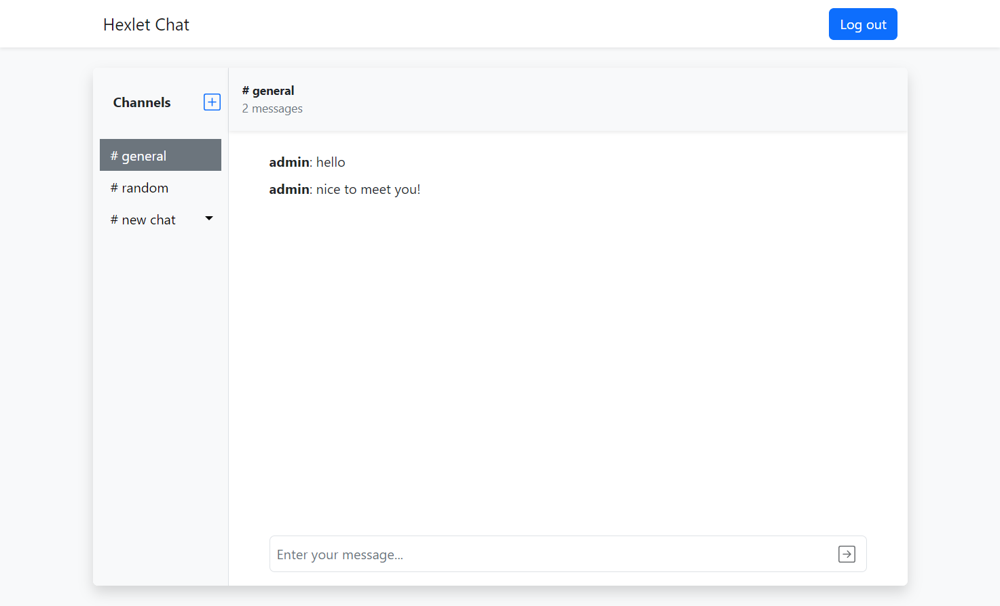

### Hexlet tests and linter status:
[](https://github.com/bushnastyaa/js-react-developer-project-12/actions)

## Description

Simple chat application - analogue of Slack. Authorization and authentication is carried out using the [JWT](https://jwt.io/introduction) technology. Chat implemented via [WebSocket](https://developer.mozilla.org/en-US/docs/Web/API/WebSockets_API). Forms are created using the [Formik](https://www.npmjs.com/package/formik) library.

Register with username and password. Feel free to send messages and create your own channels!



**Demo:** [js-react-developer-project-12-production-bbf1.up.railway.app](js-react-developer-project-12-production-bbf1.up.railway.app)

## Installation

To clone and run this application locally, you'll need Node.js and npm installed on your computer.

```bash
# Install dependencies
make install

# Run the app (served at http://localhost:3000/)
make start
```

## Tools

* React + Redux Toolkit
* [React Router v6](https://reactrouter.com/en/v6.3.0/api)
* [Socket](https://socket.io) 
* [Formik](https://www.npmjs.com/package/formik)
* [JWT](https://jwt.io/introduction)
* [Yup](https://github.com/jquense/yup)
* [React-i18next](https://react.i18next.com)
* [React Toastify](https://www.npmjs.com/package/react-toastify)
* [Leo-profanity](https://github.com/jojoee/leo-profanity)
* [Rollbar](https://rollbar.com)
* [React Bootstrap](https://github.com/react-bootstrap/react-bootstrap)
